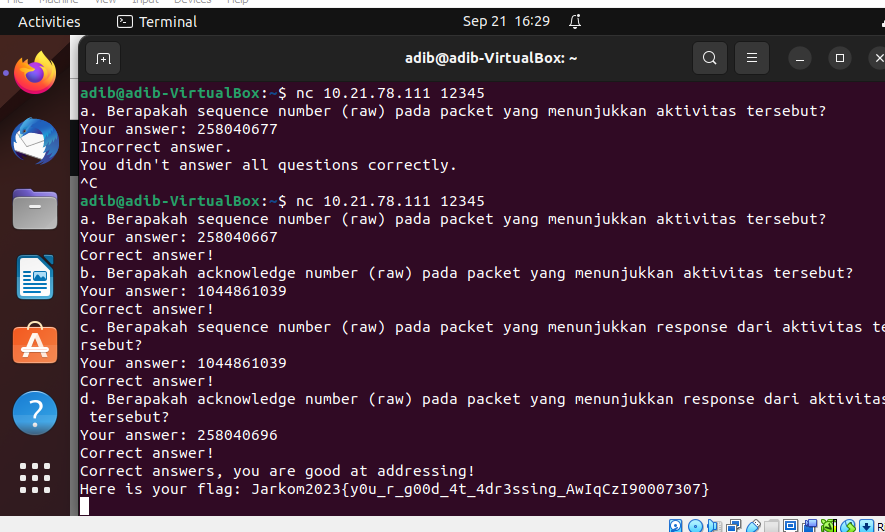

# Jarkom-Modul-1-F02-2023
Laporan resmi praktikum jaringan komputer 2023

|NAMA|NRP|
|:--:|:-:|
|Moh Adib Syambudi|5025211017|
|Samuel Hamonangan Malau|5111940000206|

## SOAL 1
#### User melakukan berbagai aktivitas dengan menggunakan protokol FTP. Salah satunya adalah mengunggah suatu file
#### a. Berapakah sequence number (raw) pada packet yang menunjukkan aktivitas tersebut?
#### b. Berapakah acknowledge number (raw) pada packet yang menunjukkan aktivitas tersebut? 
#### c. Berapakah sequence number (raw) pada packet yang menunjukkan response dari aktivitas tersebut?
#### d. Berapakah acknowledge number (raw) pada packet yang menunjukkan response dari aktivitas tersebut?

Untuk mendapatkan informasi aktivitas yang sedang dilakukan yaitu Upload file. Kita menggunakan command dibawah ini
```
ftp.request.command == 'STOR'
```

protokol yang digunakan adalah ftp dimana fungsinya untuk transfer file salah satunya upload file. kemudian untuk commandnya adalah STOR. Berdasarkan hasil display filter kita mendapatkan packet yang sedang menggunggah file. Detail dari nilai sequence number dan acknowledge number ada pada wireshark 


a.sequence number(raw): 258040667. 

b.acknowledge number(raw): 1044861039

Response dari packet yang kita dapat berada pada baris paket berikutnya. Detail dari sequence number dan acknowledge number ada di paket tersebut


c.sequence number(raw): 1044861039

d. acknowledge number(raw) : 258040696

Berikut adalah hasil dari flag yang didapatkan



## SOAL 2
#### Sebutkan web server yang digunakan pada portal praktikum Jaringan Komputer!

Halaman Web diatur oleh protokol HTTP(Hypertext Transfer Protocol). Maka untuk mendapatkan detailnya, digunakan command http untuk mencari semua packet yang menggunakan http. Kemudian di dalamnya dicari server dari halaman portal praktikum Jaringan Komputer. Didapatkanlah gunicorn


Berikut adalah hasil flag yang didapatkan


## SOAL 3
#### Dapin sedang belajar analisis jaringan. Bantulah Dapin untuk mengerjakan soal berikut: 
#### a. Berapa banyak paket yang tercapture dengan IP source maupun destination address adalah 239.255.255.250 dengan port 3702?
```
ip.dst == 239.255.255.250 || ip.src == 239.255.255.250 && udp.port == 3702
```

Filter display diatas menangkap packet yang berasal dan menuju 239.255.255.250 dengan port 3702. Maka didapatkan sebanyak 21 packet


#### b. Protokol layer transport apa yang digunakan?

Protokol yang digunakan adalah UDP berdasarkan uji coba pencarian dengan udp dan tcp pada filter. 

Berikut adalah hasil flag yang telah didapatkan


## SOAL 4
#### Berapa nilai checksum yang didapat dari header pada paket nomor 130?


Berdasarkan detail packet dari wireshark kita mendapatkan nilai checksum 0x18e5 

Berikut adalah flag yang didapat


## SOAL 5
#### Elshe menemukan suatu file packet capture yang menarik. Bantulah Elshe untuk menganalisis file packet capture tersebut.

Pengerjaan nomer 5 diberikan 2 file yaitu pcap dan zip file. soal yang sebenarnya tersimpan di dalam zip file dengan password untuk mengaksesnya. Password didapatkan dari hasil capture dengan protokol SMTP sebab mengandung pesan email yang memiliki password. Pada email tersebut password masih dalam bentuk kode enkripsi yang perlu diterjemahan terlebih dahulu. Enkripsi base64. Kemudian kita gunakan decrypt online untuk menerjemahkannya. Password dari decrypt adalah 5implePas5word


Platform decrypt


Isi pesan dari zipfile


#### a. Berapa banyak packet yang berhasil di capture dari file pcap tersebut?

Sebanyak 60 packet berdasarkan file tersebut


#### b. Port berapakah pada server yang digunakan untuk service SMTP?

Port 25 adalah nilai port yang digunakan oleh SMTP

#### c. Dari semua alamat IP yang tercapture, IP berapakah yang merupakan public IP?

alamat IP yang digunakan umum dalam jaringan yang tanpa batas. IP public digunakan oleh semua perangkat keras agar dapat mengakses sumber dari internet. Itu juga dapat diakses oleh semua orang yang terhubung pada jaringan tersebut. Aktivitas jaringan ini dimulai dari router hingga server website. Sehingga tanpa adanya kehadiran pabrik maka koneksi internet Global akan sulit berhubung langsung dengan perangkat Anda. nilai dari ip private kita adalah 10.xx.xx.xx maka diluar itu adalah ip publicnya
yaitu 74.53.140.153

Hasil Flag yang didapat


## SOAL 6
#### Seorang anak bernama Udin Berteman dengan SlameT yang merupakan seorang penggemar film detektif. sebagai teman yang baik, Ia selalu mengajak slamet untuk bermain valoranT bersama. suatu malam, terjadi sebuah hal yang tak terdUga. ketika udin mereka membuka game tersebut, laptop udin menunjukkan sebuah field text dan Sebuah kode Invalid bertuliskan "server SOURCE ADDRESS 7812 is invalid". ketika ditelusuri di google, hasil pencarian hanya menampilkan a1 e5 u21. jiwa detektif slamet pun bergejolak. bantulah udin dan slamet untuk menemukan solusi kode error tersebut.

Hasil flag dari soal adalah


## SOAL 7
#### Berapa jumlah packet yang menuju IP 184.87.193.88?

Hasil flag yang didapatkan


## SOAL 8
#### Berikan kueri filter sehingga wireshark hanya mengambil semua protokol paket yang menuju port 80! (Jika terdapat lebih dari 1 port, maka urutkan sesuai dengan abjad)

Hasil flag yang didapatkan 


## SOAL 9
#### Berikan kueri filter sehingga wireshark hanya mengambil paket yang berasal dari alamat 10.51.40.1 tetapi tidak menuju ke alamat 10.39.55.34!

Hasil flag yang didapatkan


## SOAL 10
#### Sebutkan kredensial yang benar ketika user mencoba login menggunakan Telnet

Hasil flag yang didapatkan 


